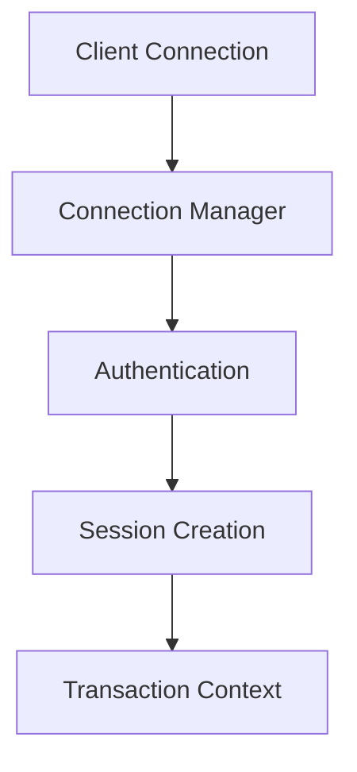
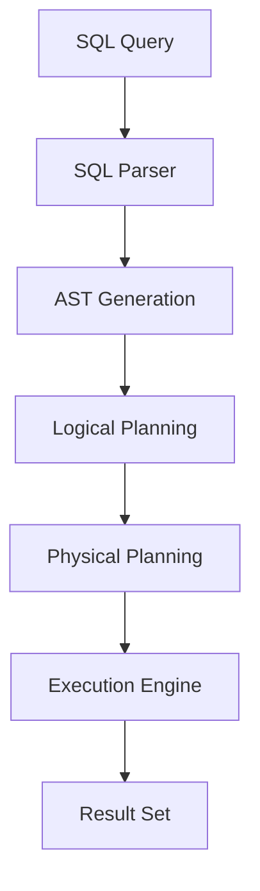
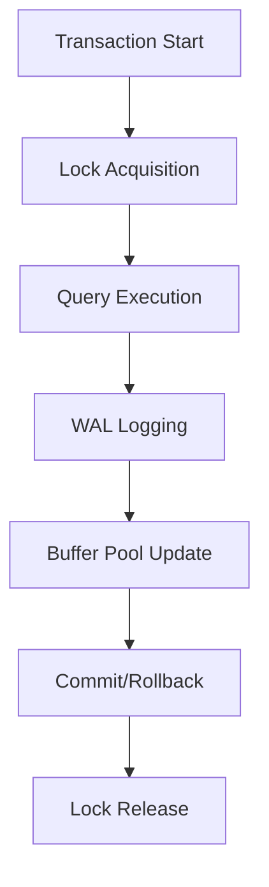

# 🏗️ Architettura del Sistema

Questa pagina descrive l'architettura interna di ColibrDB, i componenti core e come interagiscono tra loro.

## 🎯 Panoramica Architetturale

ColibrDB è progettato con un'architettura modulare che separa chiaramente le responsabilità dei vari componenti:

```
┌─────────────────────────────────────────────────────────────┐
│                    ColibrDB Architecture                   │
├─────────────────────────────────────────────────────────────┤
│  CLI Layer          │  Server Layer     │  API Layer        │
│  ┌─────────────┐    │  ┌─────────────┐  │  ┌─────────────┐  │
│  │    coldb    │    │  │ coldb-server│  │  │  ColibriCore│  │
│  └─────────────┘    │  └─────────────┘  │  └─────────────┘  │
├─────────────────────────────────────────────────────────────┤
│                    Core Engine Layer                        │
│  ┌─────────────┐  ┌─────────────┐  ┌─────────────┐        │
│  │   Storage   │  │   Buffer    │  │    WAL      │        │
│  │   Engine    │  │    Pool     │  │  Manager    │        │
│  └─────────────┘  └─────────────┘  └─────────────┘        │
│  ┌─────────────┐  ┌─────────────┐  ┌─────────────┐        │
│  │   Index     │  │ Transaction │  │   Query     │        │
│  │  Manager    │  │   Manager   │  │  Processor  │        │
│  └─────────────┘  └─────────────┘  └─────────────┘        │
├─────────────────────────────────────────────────────────────┤
│                    Storage Layer                            │
│  ┌─────────────┐  ┌─────────────┐  ┌─────────────┐        │
│  │   Heap      │  │    Index    │  │    WAL      │        │
│  │   Files     │  │    Files    │  │    Files    │        │
│  └─────────────┘  └─────────────┘  └─────────────┘        │
└─────────────────────────────────────────────────────────────┘
```

## 🧩 Componenti Core

### 1. Storage Engine

Il **Storage Engine** è il cuore del sistema, responsabile della persistenza dei dati.

#### Heap File Storage
- **File Heap Paginati**: Dati organizzati in pagine di 8KB
- **Slot Directory**: Gestione efficiente dello spazio libero
- **Free Space Map**: Tracking persistente dello spazio disponibile
- **Compattazione Online**: Riorganizzazione dati senza downtime

```swift
// Esempio di utilizzo Storage Engine
let storage = FileHeapStorage(config: storageConfig)
let page = try storage.readPage(pageId: 123)
try storage.writePage(page: page)
```

#### Caratteristiche
- **ACID Compliance**: Garantisce Atomicità, Consistenza, Isolamento, Durabilità
- **Crash Recovery**: Recupero automatico da interruzioni
- **Online Maintenance**: Manutenzione senza interruzioni del servizio

### 2. Buffer Pool Manager

Il **Buffer Pool** gestisce la cache in memoria per ottimizzare l'accesso ai dati.

#### Algoritmi di Eviction
- **LRU (Least Recently Used)**: Rimuove le pagine meno utilizzate
- **Clock Algorithm**: Variante LRU con bit di riferimento
- **Background Flushing**: Scrittura asincrona su disco

#### Configurazione
```json
{
  "bufferPoolSizeBytes": 1073741824,  // 1GB
  "pageSizeBytes": 8192,              // 8KB per pagina
  "maxDirtyPages": 1000               // Limite pagine dirty
}
```

### 3. WAL (Write-Ahead Logging)

Il **WAL Manager** garantisce la durabilità dei dati attraverso il logging.

#### WAL v2 Features
- **Record Tipizzati**: Differenti tipi di record per diverse operazioni
- **Checksum CRC32**: Verifica integrità con accelerazione hardware
- **Recovery ARIES-like**: Algoritmo di recovery robusto
- **Group Commit**: Ottimizzazione per throughput elevato

#### Struttura Record WAL
```swift
struct WALRecord {
    let type: WALRecordType
    let transactionId: TransactionID
    let pageId: PageID
    let data: Data
    let checksum: UInt32
    let timestamp: UInt64
}
```

### 4. Index Manager

Il **Index Manager** gestisce tutti i tipi di indici in modo pluggabile.

#### Tipi di Indici Supportati
- **B+Tree**: Indici ordinati per range queries
- **Hash**: Indici hash per lookups O(1)
- **ART (Adaptive Radix Tree)**: Indici compressi per stringhe
- **SkipList**: Indici per accesso sequenziale
- **LSM (Log-Structured Merge)**: Indici per write-heavy workloads

#### Esempio di Creazione Indice
```swift
// Crea un indice B+Tree
let btreeIndex = BPlusTreeIndex(
    name: "idx_users_name",
    tableName: "users",
    columnName: "name",
    config: indexConfig
)

// Crea un indice Hash
let hashIndex = HashIndex(
    name: "idx_users_email",
    tableName: "users", 
    columnName: "email",
    config: indexConfig
)
```

### 5. Transaction Manager

Il **Transaction Manager** implementa il controllo concorrenza MVCC.

#### Livelli di Isolamento
- **READ UNCOMMITTED**: Nessun isolamento
- **READ COMMITTED**: Legge solo dati committati
- **REPEATABLE READ**: Letture consistenti
- **SERIALIZABLE**: Isolamento completo

#### MVCC Implementation
```swift
struct Transaction {
    let id: TransactionID
    let startTime: Timestamp
    let isolationLevel: IsolationLevel
    let readSet: Set<PageID>
    let writeSet: Set<PageID>
}
```

### 6. Query Processor

Il **Query Processor** elabora le query SQL e le esegue.

#### Componenti
- **SQL Parser**: Converte SQL in AST
- **Logical Planner**: Ottimizzazione logica
- **Physical Planner**: Pianificazione fisica
- **Execution Engine**: Esecuzione con Volcano Iterator

#### Pipeline di Esecuzione
```
SQL Query → Parser → AST → Logical Plan → Physical Plan → Execution
```

## 🔄 Flusso di Esecuzione

### 1. Connessione e Autenticazione



### 2. Esecuzione Query



### 3. Gestione Transazioni



## 📊 Gestione Memoria

### Buffer Pool Layout

```
┌─────────────────────────────────────────────────────────────┐
│                    Buffer Pool (1GB)                        │
├─────────────────────────────────────────────────────────────┤
│  System Pages  │  User Data    │  Index Pages  │  WAL Pages │
│  (10%)         │  (70%)        │  (15%)        │  (5%)      │
└─────────────────────────────────────────────────────────────┘
```

### Memory Management
- **Page Replacement**: Algoritmi LRU/Clock per eviction
- **Dirty Page Tracking**: Gestione pagine modificate
- **Prefetching**: Caricamento anticipato di pagine
- **Compression**: Compressione pagine per risparmio memoria

## 🔒 Sicurezza e Concorrenza

### Lock Manager
- **Granularity**: Lock a livello di pagina e riga
- **Deadlock Detection**: Rilevamento e risoluzione deadlock
- **Timeout Management**: Gestione timeout per lock
- **Lock Escalation**: Conversione lock da fine a grossa granularità

### MVCC Implementation
- **Versioning**: Ogni riga ha versioni multiple
- **Snapshot Isolation**: Viste consistenti del database
- **Garbage Collection**: Pulizia versioni obsolete
- **Visibility Rules**: Regole per determinare visibilità dati

## 🚀 Ottimizzazioni Performance

### Apple Silicon Optimizations
- **CRC32 Acceleration**: Utilizzo acceleratori hardware
- **SIMD Operations**: Operazioni vettoriali per performance
- **Memory Alignment**: Allineamento memoria per ARM64
- **Cache Optimization**: Ottimizzazioni per cache L1/L2/L3

### Query Optimization
- **Cost-Based Planning**: Pianificazione basata su costi
- **Index Selection**: Selezione automatica indici
- **Join Optimization**: Ottimizzazione operazioni join
- **Predicate Pushdown**: Pushdown predicati negli operatori

## 📈 Monitoring e Telemetria

### Metriche Disponibili
- **Throughput**: Operazioni per secondo
- **Latency**: Tempo di risposta
- **Memory Usage**: Utilizzo memoria
- **Disk I/O**: Operazioni disco
- **Cache Hit Rate**: Tasso di hit cache

### Health Checks
- **Database Integrity**: Verifica consistenza dati
- **Index Integrity**: Verifica integrità indici
- **WAL Integrity**: Verifica integrità log
- **Resource Usage**: Monitoraggio risorse sistema

## 🔧 Configurazione Avanzata

### Parametri Critici
```json
{
  "bufferPoolSizeBytes": 1073741824,    // Dimensione buffer pool
  "maxConnectionsLogical": 1000000,     // Connessioni logiche max
  "maxConnectionsPhysical": 16,         // Connessioni fisiche max
  "pageSizeBytes": 8192,                // Dimensione pagina
  "walEnabled": true,                   // Abilita WAL
  "checksumEnabled": true,              // Abilita checksum
  "indexImplementation": "Hash"         // Tipo indice predefinito
}
```

### Tuning Performance
- **Buffer Pool Size**: 25-50% della RAM disponibile
- **Page Size**: 8KB per workload generali, 16KB per analytics
- **WAL Buffer**: 16MB per workload write-heavy
- **Index Type**: Hash per lookups, B+Tree per range queries

---

<div align="center">

**🏗️ Architettura ColibrDB** - *Design modulare per performance e scalabilità*

[← Quick Start]({{ site.baseurl }}/docs/wiki/Quick-Start) • [Configurazione →]({{ site.baseurl }}/docs/wiki/Configuration)

</div>
